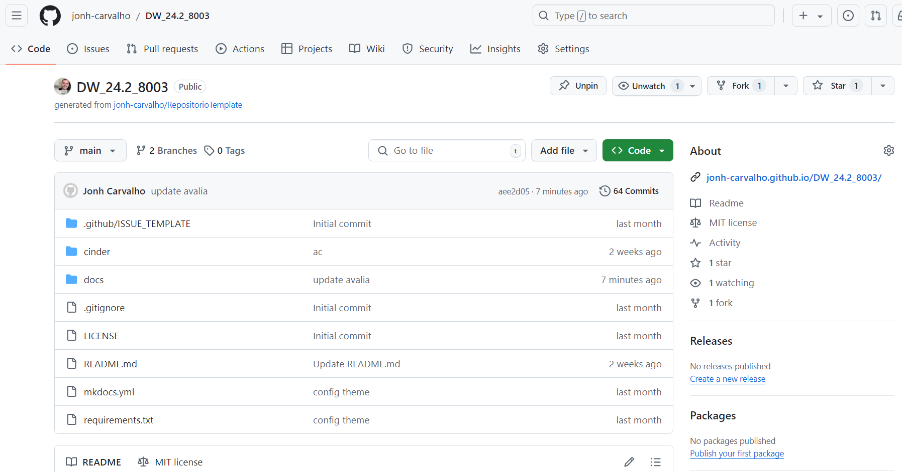
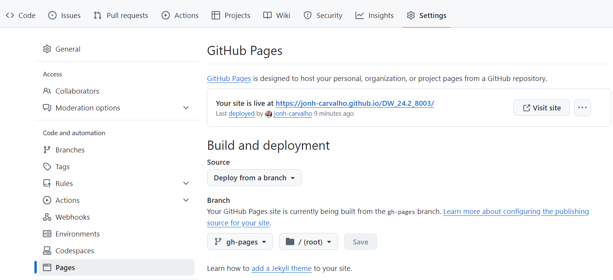

# Avaliações

- ACs
- AP1 - Entrega 03/04/2025 - Envio no Github(Prof. adicionado como colaborador) do aluno Até as 9:20h
- AP2 - Entrega xx/xx/2025 - Envio no Github (Prof. adicionado como colaborador) do aluno Até as 9:20h
- AS - Prova com a matéria toda e questões objetivas, discursivas e de desenvolvimento de código.

Todas as atividades de avaliação devem ser publicadas numa pasta /docs. Nessa pasta deverá ser criada as pastas ACs, AP1 e AP2. Após a criação das pastas deve ser feita a configuração do github pages.

- Settings

- Pages

- Em Branch fazer a seleção da pasta /docs para a publicação
- Salvar
