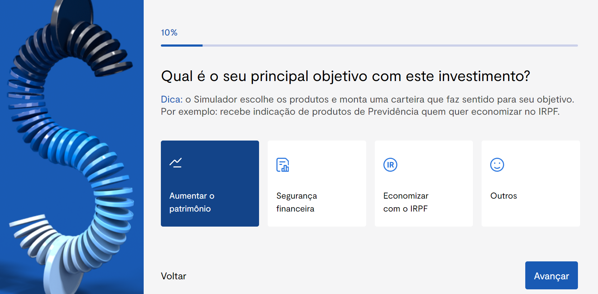

# AP2

## Objetivo


Desenvolver um site responsivo utilizando **HTML**, **CSS, JS** e técnicas de layout como **Flexbox** e **CSS Grid**, seguindo boas práticas de design web e Mobile First. Crie uma aplicação web interativa que utilize uma API  para exibir informações.

<a href="https://simulador.btgpactual.com/" target="_blank"></a>

### Entrega

- **Prazo:** 12/06/2025 até as 15:20h (**AP2 ocorrerá antes do intervalo**).
- **Obrigatório** a presença em sala de aula.
- **Enviar o projeto** para o repositório em que o professor foi adicionado como colaborador em uma pasta chamada ap2 dentro da pasta docs, com  **HTML**, **CSS**, **JAVASCRIPT** e **imagens** utilizados.
- Deve ser feita a publicação da pasta docs no **github-pages**, na pasta docs portanto devem estar a pasta ac, ap1 e ap2 e páginas disponíveis para serem visualizadas na Web
- **Apresentação** individualmente para o professor em sala de aula das **13:30 às 15:20h.**

### Critérios de Avaliação

- Validação do HTML, CSS e Links.
- Implementação de **layout responsivo** com uso de Flexbox(Micro Layout) e Grid(Macro Layout).
- **Design** e **usabilidade** do site (estética, organização visual, navegação).
- **Organização e clareza** do código.
- Implementação correta de **media queries** para diferentes dispositivos.
- > ***Comentários específicos detalhando funcionalidades em todos os itens da avaliação***
  >
- Busca na Api
- Construção de Interfaces via Javascript

### Requisitos

1\. **Estrutura do site:**

- O site deverá privilegiar a exibição em dispositivos mobile, no máximo 600px e também deve ser desenvolvido um layout para desktop.
- Utilização correta de **tags semânticas** do HTML5 (ex.: `<header>`, `<nav>`, `<main>`, `<section>`, `<article>`, `<footer>`).

2\. **Responsividade:**

- O site deve se adaptar corretamente a **diferentes tamanhos de tela** (desktop e smartphone).
- Utilização de **media queries** no CSS para ajustar o layout conforme a largura da tela do mobile e desktop.

2.1\. **Layout:**

- Deverá ser possível ver diferentes layouts de página dependendo do dispositivo (ex.: layout em uma coluna para mobile, e em duas ou mais colunas para desktop).

3\.**Formulário de Contato:**

- Deve possui um placeholder para a orientação sobre o preenchimento caso necessário.
- Validação básica dos campos com **JAVASCRIPT** [Não permitindo a inserção de números e caracteres especiais], quando for necessário.

5\.**Design de rodapé:**

- Usando flexbox ou grid:
  - Crie um rodapé que tenha três seções: Sobre, Links e ícones de mídia social.

6\.**Estilo e Design:**

- Aplicar um esquema de cores consistente e harmonioso.
- O design deve ser moderno e seguir boas práticas de **UX/UI**, com foco na legibilidade e usabilidade.
- Uso de **tipografia** apropriada, com pelo menos **duas fontes** diferentes.
- Usar **ícones** quando necessário (ex.: Font Awesome).

7\.**Código organizado:**

- O código deve ser organizado, indentado e comentado adequadamente.
- O **CSS** deve ser escrito em um arquivo separado e vinculado corretamente ao HTML.
- O **Javascript** deve ser escrito em um arquivo separado e vinculado corretamente ao HTML.
- As imagens devem ser colocadas em uma subpasta "imagens"

## Cenário

Você deve desenvolver um site que dará apoio a tomada de decisão de investimento de acordo com o seu perfil e objetivo. Desenvolver uma página web responsiva e interativa com slides em que marcamos resposta(s) e no final há um relátório com as conclusões e um info gráficos. A simulação deve consumir uma API externa e permita aos usuários comparar diferentes tipos de investimentos (renda fixa, renda variável, criptomoedas, etc.) com base em parâmetros personalizados. A página deve fornecer uma análise visual clara dos retornos esperados, riscos associados e outros fatores relevantes para ajudar os usuários a tomar decisões informadas.

## Desenvolvimento

- **Header:** deve ser exibido no topo da página com um menu de navegação simples. O menu deve conter links para diferentes páginas do site: "Dados Econômicos" e "Investimentos".

- **Main: Slides** deve conter o slide com o questionário e a conclusão do relatório com gráficos. O slide será simples, mas funcional, com foco na usabilidade e na apresentação clara das informações. Ela permitirá que o usuário insira valores iniciais, selecione tipos de investimento e visualize os resultados em tabelas e gráficos interativos. Além disso, oferecerá explicações breves sobre cada tipo de investimento para educar os usuários.
  
  - Estrutura de Slides
  - Formulários Interativos
  - Consumo de API externa
  - Gráficos Interativos 
  
- **Main: Dados Econômicos**

  - Tabela de Dados Econômicos construída com JS a partir de dados de uma API externa.
  

- **Main: Investimentos**

  - Tabela de Investimentos construida com JS a partir de dados de uma API externa.

- **Footer:** deve ter dados de contato, links para redes sociais e informações de copyright. 

#### Plano de Desenvolvimento Faseado

**Fase 1:** Estrutura Básica e Slides
Comece com a estrutura HTML, adicione os estilos CSS para responsividade e a funcionalidade básica de slides com JavaScript.

**Fase 2:** Formulários e Entrada de Dados
Integre os formulários para o usuário inserir informações como o valor inicial e as seleções de investimento.

**Fase 3:** Consumo de API e Lógica de Comparação (Mock)
Nesta fase, você pode simular o consumo de uma API com dados "mock" (fictícios) enquanto decide qual API de dados financeiros usar. Implemente a lógica inicial para comparar investimentos com base em dados pré-definidos.

**Fase 4:** Visualização de Dados (Gráficos)
Integre uma biblioteca de gráficos (como Chart.js ou Plotly) para exibir os resultados visualmente.

**Fase 5:** Relatório Final e Aprimoramentos
Crie a seção do relatório final e refine a interface do usuário, adicione as explicações educacionais e teste a responsividade.

### Dados Econômicos

APIs de Dados Financeiros Reais:

##### API do Banco Central do Brasil
  
O Banco Central disponibiliza uma série de dados abertos sobre a economia brasileira, incluindo taxas de câmbio, índices econômicos (como IPCA e IGP-M), e informações sobre operações financeiras.
  - URL : [Banco Central](https://www.bcb.gov.br/)
  - Endpoints populares :
    - Taxa de câmbio (Dólar, Euro, etc.)
    - Índice Nacional de Preços ao Consumidor Amplo (IPCA)
    - Taxa Selic
  
##### Awesome API (Moedas e Finanças)

Uma API gratuita que fornece informações sobre cotações de moedas, criptomoedas, impostos e outros dados financeiros. É especialmente útil para projetos envolvendo conversões de moedas e acompanhamento de ativos financeiros.

- URL : [Awesome API](https://docs.awesomeapi.com.br/)

- Endpoints populares :
  - /json/last/:currency (Cotações de moedas como Dólar, Euro, Bitcoin, etc.)
  - /json/taxes (Informações sobre impostos e tributos)

##### Brasil API

Descrição : Uma API pública que fornece dados úteis para o Brasil, como CNPJ, CEP, dados fiscais (NFe), e informações sobre bancos e instituições financeiras.

- URL : [Brasil API](https://brasilapi.com.br/)
- Endpoints populares :
  -/api/cnpj/v1/{cnpj} (Consulta de CNPJ com informações detalhadas sobre empresas)
  -/api/banks/v1 (Lista de bancos e instituições financeiras no Brasil)
  -/api/cep/v1/{cep} (Consulta de endereços por CEP)

#### Alpha Vantage (Mercado Financeiro Global)

Descrição : Uma API global que fornece dados de ações, commodities, moedas e criptomoedas. Embora seja uma API internacional, ela pode ser usada para acompanhar ativos negociados no Brasil, como ações da B3.

- URL : [Alpha Vantage](https://www.alphavantage.co/)
- Endpoints populares :
  - /query?function=TIME_SERIES_DAILY (Dados históricos de ações)
  - /query?function=CURRENCY_EXCHANGE_RATE (Taxas de câmbio)

#### Receita Federal (Dados Abertos)

 A Receita Federal disponibiliza alguns dados abertos relacionados a impostos, contribuições e fiscalização. Embora não seja uma API tradicional, é possível acessar esses dados por meio de arquivos CSV ou JSON.

- URL : [Receita Federal](http://idg.receita.fazenda.gov.br/dadosabertos/)

- Endpoints populares :
  - Arrecadação federal por estado e município.
  - Informações sobre regimes tributários (Simples Nacional, Lucro Presumido, etc.).

#### IBGE (Instituto Brasileiro de Geografia e Estatística)
O IBGE oferece uma API com dados estatísticos e geográficos do Brasil, incluindo PIB, população, inflação e outras métricas econômicas.

- URL : [IBGE](https://servicodados.ibge.gov.br/api/docs)
- Endpoints populares :
  - /estatisticas (Dados econômicos e sociais)
  - /localidades (Informações geográficas, como estados e municípios)

#### API de Tributos e Impostos (Calculadoras de Impostos)
Existem APIs especializadas em cálculo de impostos e tributos no Brasil, como ICMS, ISS, IPI, e outros. Alguns exemplos incluem:

- URL: [Calculadoras de Impostos](https://tributos.io/)

- Calculadora de Impostos: Serviços personalizados para calcular impostos com base em regras fiscais.

> Importante: A maioria das APIs financeiras robustas exige chaves de API e, em alguns casos, são pagas ou têm limites de uso para planos gratuitos. Nunca exponha suas chaves de API diretamente no código JavaScript do lado do cliente (frontend).


<!--
8\. **Plano em Pseudocódigo**

* Criar a estrutura de arquivos:
* Criar uma pasta para o projeto.
* Criar arquivos index.html, styles.css e script.js.
* Configurar o arquivo HTML:
* Adicionar um formulário para buscar Pokémon pelo nome.
* Adicionar uma área para exibir os dados do Pokémon.
* Incluir referências aos arquivos CSS e JavaScript.
* Estilizar a interface com CSS:
* Adicionar estilos básicos para o formulário e a área de exibição.
* Implementar a lógica com JavaScript:
* Adicionar um evento de submissão ao formulário.
* Usar fetch para fazer requisições à API do Pokémon.
* Processar e exibir os dados recebidos na interface do usuário.

**Passo 1:** Criar a estrutura de arquivos

```bash
mkdir pokemon-site
cd pokemon-site
touch index.html styles.css script.js
```

- **Passo 2:** Configurar o arquivo HTML

```html

<!DOCTYPE html>
<html lang="en">
<head>
    <meta charset="UTF-8">
    <meta name="viewport" content="width=device-width, initial-scale=1.0">
    <title>Pokémon Search</title>
    <link rel="stylesheet" href="styles.css">
</head>
<body>
    <h1>Pokémon Search</h1>
    <form id="pokemon-form">
        <input type="text" id="pokemon-name" placeholder="Enter Pokémon name" required>
        <button type="submit">Search</button>
    </form>
    <div id="pokemon-data"></div>

    <script src="script.js"></script>
</body>
</html>
```

- **Passo 3:** Estilizar a interface com CSS

```cs
/* styles.css */
body {
    font-family: Arial, sans-serif;
    text-align: center;
    margin: 0;
    padding: 0;
    background-color: #f0f0f0;
}

h1 {
    margin-top: 20px;
}

form {
    margin: 20px auto;
}

input, button {
    padding: 10px;
    font-size: 16px;
}

#pokemon-data {
    margin-top: 20px;
}

#pokemon-data img {
    width: 150px;
    height: 150px;
}
```

- **Passo 4:** Implementar a lógica com JavaScript:

```js
// script.js
document.getElementById('pokemon-form').addEventListener('submit', async (event) => {
    event.preventDefault();
    const name = document.getElementById('pokemon-name').value.toLowerCase();
    const response = await fetch(`https://pokeapi.co/api/v2/pokemon/${name}`);
    const data = await response.json();
  
    if (response.ok) {
        document.getElementById('pokemon-data').innerHTML = `
            <h2>${data.name}</h2>
            
        `;
    } else {
        document.getElementById('pokemon-data').innerHTML = '<p>Pokémon not found</p>';
    }
});
```

Agora, você pode abrir o arquivo index.html no seu navegador e buscar informações sobre qualquer Pokémon.

### Questões

1\. Busque e exiba as informações de um Pokémon.

- name, sprites, height, weight, abilities, types, moves, baseExperience, stats.

2\. Buscar por Tipo Pokémon e mostrar uma galeria com os 10 primeiros Pokémons

- Layout deve ser 2 colunas e 5 linhas para o Mobile
- Layout de 5 colunas e duas linhas para Desktop.

3\. Exibir todos os Pokémon de cada região.

- Layout deve ser 2 colunas e 5 linhas para o Mobile
- Layout de 5 colunas e duas linhas para Desktop.

4\. Adicionar o css de efeito flip card(virar a carta) para cada item da galeria.

- Ao passar o mouse sobre a carta, ela gira e fica mostrando a parte de trás da carta enquanto o mouse estive sobre a carta.
- A parte de trás da carta deve usar uma imagem da carta oficial pokemon.

5\. Adicionar a funcionalidade de ao clicar em cada item da galeria, abrir uma janela modal com todas as infomarções do Pokémon clicado

6\. Desenvolver o layout da janela modal de modo que ele tenha a estrutura de uma carta oficial Pokémon.

7\. Pesquise a PokeApi, e acrescente uma nova funcionalidade de busca e exibição no site, que ainda não tenho sido usada.

### Aplicativos e Sites a serem estudados e se inspirar

- [PokeAPI](https://pokeapi.co/) - Exemplos de consumo da Api
- Site - [Pokédex](https://www.pokemon.com/br/pokedex)
- [Datadex](https://datadex.talzz.com/)
- [PokePedia](https://play.google.com/store/apps/details?id=com.pascualgorrita.pokedex&hl=pt_BR&pli=1)
- [MasterDex](https://play.google.com/store/apps/details?id=com.lorenzogreco.pokedex_provider&hl=pt_BR)
- [Goldex](https://play.google.com/store/apps/details?id=com.goldex&hl=pt_BR)
- [Pocket Gallery](https://play.google.com/store/apps/details?id=com.eurekaffeine.pokedex.renaissance&hl=pt)

-->

 

